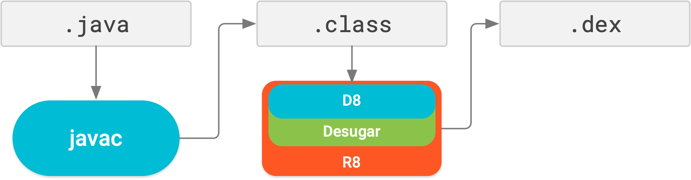

# ATFS

<br>

<p align="center">
<b>ATFS</b> - <b>A</b>ndroid <b>T</b>ooling <b>F</b>rom <b>S</b>cratch
<br>
<code>A learning journey into Android development tooling.</code>
</p>

<br>

---

👉 Read Chapter 1: https://github.com/hethon/ATFS/tree/master \
👉 Read Chapter 2: https://github.com/hethon/ATFS/tree/chapter-2-gradle-cli

---
## Chapter 3

**Replacing the custom Gradle script with the Android Gradle Plugin (AGP)**

In [Chapter 2](https://github.com/hethon/ATFS/tree/chapter-2-gradle-cli), we replaced our basic `build.py` script with `build.gradle`. We gained the power of *task-level* incremental builds, meaning Gradle was smart enough to skip entire build tasks (e.g., `compileResources`, `linkResources`, `compileJava`) if the inputs and outputs of that task hadn't changed.

We ended `Chapter 2` by highlighting a limitation in our `build.gradle`: our custom Gradle tasks were not *file-level* incremental. If one Java file out of a thousand changed, our `compileJava` task still blindly recompiled all 1,000 files.

Let's add one more major limitation of our custom script to make the case for introducing AGP even stronger: **Environment Dependency**.
Our custom script only works if the machine running it has the exact versions of `build-tools` and `platforms` pre-installed in the exact expected directories. If another developer clones the repository, the build will immediately crash unless they replicate our precise SDK environment.

> <br>
>
> These limitations are our immediate justification for adopting AGP. In reality, AGP handles a massive amount of Android-specific complexity that our manual script hasn't even encountered yet. For example:
>
> - **Dependency Management:** If we wanted to add a third-party Android library (like `Retrofit` or `Material Design`) to our manual script, we would have to manually extract its `.aar` file, merge its resources with ours, and add its classes to our classpath. AGP handles this seamlessly.
> - **Manifest Merging:** Automatically combining our `AndroidManifest.xml` with the manifests of any libraries we use.
> - **Build Variants:** Effortlessly creating `debug` and `release` versions of our app, or "flavors" (like a Free vs. Paid version) from the exact same codebase.
> - **Code Shrinking:** Running tools like `R8` to remove unused code and make the final APK smaller.
>
> <br>

### What is a Gradle Plugin?

Before diving into AGP, let's try to understand the general concept of Plugins in Gradle.

At its core, Gradle is an agnostic, general-purpose build automation engine. Out of the box, it does not know how to compile Java, nor does it know what an Android application is. Because of this, Gradle can be used as a build tool for a number of programming languages, even C++ or Python.

To make Gradle do actual work, we have to write our own custom tasks just like we did in `Chapter 2`, or install a **Plugin** for our particular language or workflow.

Gradle plugins exist to extend Gradle's capabilities by injecting reusable build logic. When applied to a project, a plugin automatically defines tasks, and establishes new behaviors so developers do not have to write build scripts from scratch. *(You can read more about Gradle plugins in the [official documentation](https://docs.gradle.org/current/userguide/plugins.html)).*

There are thousands of plugins in the Gradle ecosystem. Most of them can be found on the official [Gradle Plugin Portal](https://plugins.gradle.org/).

However, massive companies often host their own plugin repositories. Google hosts their official Android packages, including AGP, in their own [Google Maven Repository](https://maven.google.com/). We will need to tell Gradle exactly where to look to find it.

### Setup AGP

Create a new file named `settings.gradle` in the project root:

```bash
touch settings.gradle
```

**Content:**
```groovy
pluginManagement {
    repositories {
        google()
        gradlePluginPortal()
    }
}

rootProject.name = 'HelloAndroid'
```

Before Gradle reads `build.gradle`, it first reads `settings.gradle` to initialize the build environment.

The `pluginManagement` block tells Gradle where plugins and their dependencies can be downloaded from.

- `google()` points to Google's Maven repository, where AGP is hosted.
- `gradlePluginPortal()` points to the Gradle Plugin Portal.

> `google()` is a built-in shortcut for `https://maven.google.com/`, and `gradlePluginPortal()` is the shortcut for `https://plugins.gradle.org/`.

**Why do we need to include both repositories if AGP is hosted by Google?**
The Android Gradle Plugin does not operate in isolation; it depends on other libraries and foundational Gradle plugins to function. Those dependencies often have their own dependencies, creating a deep chain. Some of these dependencies come from `gradlePluginPortal()` that's why we need to include both `google()` and `gradlePluginPortal()`.

Next, delete everything inside `build.gradle`.
*(Satisfying, isn't it?)*

Open your newly emptied `build.gradle` file and add the `plugins` block to apply AGP to our project:

```groovy
plugins {
    id 'com.android.application' version '9.1.1'
}
```
*(Note: I used version 9.1.1 here, which is the latest stable release at the time of writing.).*

When you apply the Android Gradle Plugin, it injects a custom configuration block called `android {}` into Gradle. This is where we define the rules for our app.

Add this configuration below the `plugins` block:

```groovy
android {
    namespace 'com.example.hello'
    compileSdk 34

    defaultConfig {
        applicationId 'com.example.hello'
        minSdk 23
        targetSdk 34
        versionCode 1
        versionName "1.0"
    }
}
```

**Understanding the Android Configuration**:

- **`applicationId`**: A string that uniquely identifies your app on the device and in the Google Play Store. During the build, AGP injects this value as `package="..."` into the final, compiled `AndroidManifest.xml` inside the APK. The Android OS uses this to install the app.
    > The `applicationId` should **never** be changed after an app is published. If it is changed, the Google Play Store will treat any subsequent upload as a completely new, separate app.

- **`namespace`**: This tells AGP the base Java package name to use when generating the `R.java` and `BuildConfig.java` classes.

    - The `namespace` should always match our project's actual Java package structure (in our case, `com.example.hello`) so our imports don't break. If `applicationId` is omitted, AGP will default to using the `namespace` as the Application ID, but it is best practice to declare both explicitly.

    > <br>
    >
    > **The History of `namespace` vs `applicationId`**
    >
    > This separation didn't always exist. In older Android projects, you only had the `package="com...""` attribute in the `AndroidManifest.xml`. It was forced to do two completely different jobs at the same time:
    > 1. Act as the unique Application ID for the Google Play Store.
    > 2. Tell the build tools which Java package to use when generating the `R.java` file.
    >
    > This caused a major problem. If a developer wanted to build a "Free" version and a "Pro" version of their app, they had to change the `package` attribute in the Manifest so the Play Store would accept it as a separate app. But doing so *also* changed where `R.java` was generated, which instantly broke all the Java code in the project!
    >
    > Google eventually solved this by splitting the responsibilities. Now, `namespace` handles the internal code structure, and `applicationId` handles the external OS identity. You can change your `applicationId` to create a "Pro" version without touching a single line of your Java code.
    >
    > <br>

    <br>

*   **`compileSdk`**: This tells AGP which Android API version to compile against. This entirely replaces the need for us to hardcode the path to `android-34/android.jar` in our custom tasks! AGP will locate the correct framework JAR automatically.
*   **`minSdk`**: Defines the oldest Android version your app supports. AGP injects this as `minSdkVersion="..."` into the final Manifest.
*   **`targetSdk`**: Defines the API level the app was designed and tested against. AGP injects this as `targetSdkVersion="..."` into the final Manifest.
*   **`versionCode` / `versionName`**: Internal and public version numbers. AGP injects these as attributes into the root `<manifest>` tag.


Notice how **declarative** this configuration is. We are no longer instructing Gradle how to perform each build step. Instead, we are defining what the application should look like, its identity, SDK targets, ..., and letting AGP take responsibility for translating that model into the actual build process.

### Cleaning up the Manifest

Because AGP now manages these properties and dynamically injects them into the APK during the build process, we must delete them from our source code.

In fact, if you try to build the app right now without deleting the `<uses-sdk>` block from your `src/main/AndroidManifest.xml`, AGP 9.0+ will immediately crash the build and throw this exact error:

```text
> Manifest merger failed : The <uses-sdk> tag was detected in your main AndroidManifest.xml file... it is no longer allowed for controlling SDK versions (e.g., targetSdkVersion, minSdkVersion). Starting with Android Gradle Plugin 9.0.0, these attributes have been deprecated within the manifest.

  To fix: Remove <uses-sdk> from your AndroidManifest.xml.
```

Google has strictly enforced the rule that `build.gradle` is the **Single Source of Truth** for SDK versions and app identity.

Open your `AndroidManifest.xml` and delete the `package`, `versionCode`, `versionName`, and the entire `<uses-sdk>` block.

The cleaned-up file should look exactly like this:

```xml
<manifest xmlns:android="http://schemas.android.com/apk/res/android">

    <application android:label="@string/app_name">
        <activity android:name=".MainActivity" android:exported="true">
            <intent-filter>
                <action android:name="android.intent.action.MAIN"/>
                <category android:name="android.intent.category.LAUNCHER"/>
            </intent-filter>
        </activity>
    </application>

</manifest>
```

### Listing the new tasks

Let's try to see the list of all the tasks available to our project. We should be able to see the new tasks that are added by AGP.

```bash
gradle tasks --all --info
```

> `--all` shows all tasks, including those not normally displayed.\
> `--info` enables more detailed logging, so we can see additional information about what Gradle is doing under the hood.

Before Gradle can list the tasks, it has to read our `build.gradle` file. When it sees `id 'com.android.application'`, it enters the **plugin resolution phase**.

Because this is the first time we are running AGP on this machine, you will see a massive list of files being downloaded, which may take a few minutes.

We will inspect exactly what was downloaded in a later section.

### Running an AGP task

In the previous step, after the `gradle tasks --all --info` command finished, your terminal printed out a long list of new tasks injected by AGP. Among these tasks is `assembleDebug`. This task is used to build a debug variant apk.

When a task executes, Gradle may need to resolve one or more *dependency configurations* associated with that task.

> <br>
>
> **What is a "Dependency Configuration" in Gradle?**
>
> In Gradle, a Dependency Configuration (or Configuration in short) is simply a named set of dependencies grouped together for a specific purpose. For example, the `compileClasspath` configuration holds all the libraries needed to compile your code, while the `runtimeClasspath` holds the libraries needed to actually run it.
>
> When a task like `assembleDebug` runs, Gradle must "resolve" these configurations, meaning it searches your local cache or the internet to find every exact file required before it allows the task to start.
>
> <br>

<br>

Let's run the build task and keep the `--info` flag on so we can watch AGP resolve its configurations:

```bash
gradle assembleDebug --info
```

Configuration resolution does not start immediately. Instead, you will first see these lines in the logs:

```text
Preparing "Install Android SDK Build-Tools 36 v.36.0.0".
"Install Android SDK Build-Tools 36 v.36.0.0" ready.
Installing Android SDK Build-Tools 36 in /home/user/Android/build-tools/36.0.0
"Install Android SDK Build-Tools 36 v.36.0.0" complete.
"Install Android SDK Build-Tools 36 v.36.0.0" finished.
```

The logs are showing that `build-tools` version `36.0.0` is being downloaded directly into our SDK directory.

Starting from [AGP 3.0.0](https://developer.android.com/build/releases/agp-3-0-0-release-notes#behavior_changes), every version of AGP requires a specific minimum version of `build-tools`. For AGP 9.1.1, that minimum required version is `36.0.0`, which is different from the version we installed in `Chapter 1`, `34.0.0`. Because the required version is missing from our machine, AGP downloads it and stores it in `$ANDROID_HOME/build-tools/36.0.0`.

This behavior highlights another massive advantage of AGP: **It auto-downloads missing SDK components.**

If we hadn't manually installed the `platforms;android-34` libraries, AGP would auto-download them. If we hadn't installed `platform-tools`, it would auto-download it.

This makes replicating build environments easy. A new contributor can clone our repository, run `gradle assembleDebug`, and AGP will guarantee they have the exact right SDK components installed to build the app.

> <br>
>
> Looking back, I realized we could have just installed `build-tools;36.0.0` manually in `Chapter 1` instead of `34.0.0`.
>
> I originally installed `34.0.0` because I mistakenly thought the `build-tools` version had to match the `platforms` API version. I installed `platforms;android-34` because I was targeting Android 14, and I assumed the build tools needed to be version 34 as well.
>
> In reality, they are completely independent. `platforms` dictates the Android APIs your code can access, while `build-tools` dictates the compilers doing the work. You can (and generally should) use the latest stable version of `build-tools` to compile apps even if you are targeting older platforms.
>
> But honestly, this mistake was for the better! If I had installed `36.0.0` from the start, AGP wouldn't have needed to intervene, and we would have completely missed the opportunity to see AGP's powerful auto-provisioning feature in action.
>
> <br>

<br>

After the `build-tools;36.0.0` download finishes, AGP attempts to execute the task graph for `assembleDebug`.

However, the build stops as soon as Gradle reaches the first task that requires dependency resolution:

```text
> Task :processDebugNavigationResources FAILED
Build cca63e89-cf63-44d1-9655-1eeed3c93b20 is closed

FAILURE: Build failed with an exception.

* What went wrong:
Execution failed for task ':processDebugNavigationResources'.
> Could not resolve all files for configuration ':debugRuntimeClasspath'.
   > Cannot resolve external dependency org.jetbrains.kotlin:kotlin-stdlib:2.2.10 because no repositories are defined.
     Required by:
         root project 'HelloAndroid'
```

The specific task that fails is incidental. The important detail is that this is the moment Gradle attempts to resolve a dependency configuration (`debugRuntimeClasspath`). Since no repositories have been declared, Gradle has no location from which it can download the required artifacts, so the build fails.

Earlier, we defined `pluginManagement { repositories { ... } }`. However, that block only tells Gradle where to find dependencies during *plugin resolution*. We haven’t yet told Gradle where to find dependencies during *configuration resolution*.

> <br>
>
> One subtle but important detail: **configurations are resolved lazily.**
>
> AGP creates a whole bunch of configurations that are waiting to be resolved, such as `debugRuntimeClasspath`, `debugCompileClasspath`, `releaseRuntimeClasspath`, `releaseCompileClasspath`, ..., but Gradle does not resolve them all up front.
>
> A configuration is only resolved when some task actually needs it. That is why we didn’t see this error until we ran `assembleDebug`.
>
> If we later run `assembleRelease`, don’t be surprised if Gradle kicks off another round of downloads while resolving configurations associated with the task such as `releaseCompileClasspath` and `releaseRuntimeClasspath`.
>
> <br>

To fix this issue, we should open `settings.gradle` and add the `dependencyResolutionManagement` block below our `pluginManagement` block:

```groovy
dependencyResolutionManagement {
    repositoriesMode.set(RepositoriesMode.FAIL_ON_PROJECT_REPOS)
    repositories {
        google()
        mavenCentral()
    }
}
```

> `mavenCentral()` is a built-in shortcut for `https://repo.maven.apache.org/maven2/`

*(Note: The `FAIL_ON_PROJECT_REPOS` setting is a modern best practice. It forces all repositories to be declared centrally in `settings.gradle` rather than scattered across individual `build.gradle` files, preventing messy configurations in multi-module projects).*

Let's run the build command one more time:

```bash
gradle assembleDebug --info
```

Now that we have defined `dependencyResolutionManagement`, Gradle knows where to look for external dependencies. You will likely see another round of downloads, which may take a few minutes as AGP resolves and fetches the required artifacts.

Once this completes, the actual build process begins, and shortly after, the build should finish successfully.

Because we named our project in `settings.gradle`, AGP intelligently names the output file for us. You can find it here:

```bash
ls build/outputs/apk/debug/HelloAndroid-debug.apk
```

At this point, we could use `adb` to install it on our connected device, exactly like we did with our manually built APKs in the previous chapters:

```bash
adb install build/outputs/apk/debug/HelloAndroid-debug.apk
```

However, AGP also provides an installation task:

```bash
gradle installDebug
```

This task will verify the APK exists (builds it if necessary), connect to your phone via ADB, and install the app automatically.

### Exploring the Gradle cache

So far in this chapter, we’ve watched Gradle download a lot of files.

At first glance, this can feel a little mysterious. What exactly was downloaded? Where did it go? And how do those files relate to the tools we used manually in the previous chapters?

Let’s pop open the Gradle cache and take a look at some of the familiar tools.

The downloaded files are permanently stored in the global Gradle cache at `~/.gradle/caches/modules-2/files-2.1`. Because they are cached globally, any subsequent builds, even for completely different Android projects on your machine, will reuse these files and start instantly.

Let's navigate into that directory to see exactly what Gradle downloaded:

```bash
cd ~/.gradle/caches/modules-2/files-2.1
```
You’ll see a list of folders similar to this:
```text
com.android.application
com.android.databinding
com.android.tools
com.android.tools.analytics-library
com.android.tools.build
com.android.tools.build.jetifier
com.android.tools.ddms
com.android.tools.layoutlib
...
```
Each folder corresponds to a Maven groupId.

Inside the cache, Gradle stores artifacts using this directory structure:
```text
groupId / artifactId / version / SHA-1 checksum / files
```

For example, the main JAR for the Android Gradle Plugin itself lives here:
```bash
ls com.android.tools.build/gradle/*/*/gradle-9.1.1.jar
```
By exploring this cache, we can see that build tools aren't magic, they are just massive collections of pre-compiled libraries working together.

Let's explore some of the artifacts in the cache that replace the tools we manually invoked in previous chapters:

#### **`com.android.tools.build:builder`**:

The artifact `com.android.tools.build:builder` bundles the classes of both `D8` and `R8`.

We know **D8** from `Chapter 1`. It is the tool we used to convert our Java `.class` files into Android `.dex` files. **R8** is essentially a superset tool that handles `D8 (Dexing)` + `Shrinking` + `Optimization` + `Obfuscation`.

[](https://developer.android.com/build/releases/agp-3-4-0-release-notes#behavior-changes)


To prove that these tools are bundled inside this artifact, we can invoke them directly from the JAR itself:

```bash
java -cp com.android.tools.build/builder/*/*/builder-*.jar com.android.tools.r8.R8 --version
```

```bash
java -cp com.android.tools.build/builder/*/*/builder-*.jar com.android.tools.r8.D8 --version
```

Instead of relying on the SDK's build-tools folder like we did in Chapter 1, AGP uses this cached artifact to access the `R8/D8` libraries programmatically.

#### **`com.android.tools.build:apksig`**:
This library provides the APK signing logic used by AGP.

In `Chapter 1`, we used the standalone `apksigner` command. Under the hood, `apksigner` and AGP both rely on this same library.

#### **`com.android/zipflinger`**:
In `Chapter 1`, we used the standard Linux `zip -j` command to add `classes.dex` to our APK. We then had to run a separate tool, `zipalign`, to shift the bytes around so the Android OS could read them efficiently.

The problem with generic ZIP tools is that they are **not** designed for incremental builds. As an app grows, the APK may contain multiple `.dex` files, and hundreds of compiled resources. If only one file changes, a traditional ZIP tool often has to rewrite most, or all, of the archive.

`zipflinger` is a specialized ZIP library built by Google specifically for Android packaging. It is optimized for incremental updates, allowing AGP to modify APKs much more efficiently.

It also handles alignment on the fly while writing the archive, so eliminates the need to run `zipalign` as a separate step afterward.

#### **`com.android.tools.build:aapt2`**:

Unlike the tools above, `aapt2` isn't a Java library. It's a platform-dependent, native C++ binary. It's wrapped in this artifact just so that it can be pulled as a Maven dependency by AGP.

We can see the actual binary without unzipping the jar using the `unzip -l` command.

```bash
unzip -l com.android.tools.build/aapt2/*/*/aapt2-*-linux.jar
```
```text
  Length      Date    Time    Name
---------  ---------- -----   ----
        0  1980-02-01 00:00   META-INF/
       25  1980-02-01 00:00   META-INF/MANIFEST.MF
  6232264  1980-02-01 00:00   aapt2                👈
   100861  1980-02-01 00:00   NOTICE
---------                     -------
  6333150                     4 files
```

Prior to AGP 3.2.0, `aapt2` was provided exclusively through `build-tools`. Starting with [AGP 3.2.0](https://developer.android.com/build/releases/agp-3-2-0-release-notes#behavior-changes), Google began distributing `aapt2` as a Maven artifact (`com.android.tools.build:aapt2`). This change allows AGP to bundle and use a specific version of `aapt2` with the latest fixes and features, without having to wait for the infrequent `build-tools` releases.

<br>

Of course, these are just a handful of the artifacts AGP pulls in. We focused on them because they correspond to tools we already used manually in previous chapters.

If you browse through the cache, you’ll find dozens of other libraries for linting, Kotlin compilation, data binding, testing, and many other parts of the Android build process.

Downloading hundreds of megabytes of build tooling can feel like overkill for our tiny Hello World app. But AGP wasn’t designed for toy projects, it was built to compile large, complex Android applications with hundreds of modules and millions of lines of code as efficiently as possible.

Our small project doesn’t exercise all of that machinery, but it gives us a solid **mental model** for how the Android build system works under the hood.


---

### The Gradle Wrapper

If you’ve ever generated a fresh project in Android Studio, you’ve probably noticed a few specific files sitting in the root directory: `gradlew`, `gradlew.bat`, and a `gradle/wrapper/` folder. Let's finally make sense of them.

We have seen how AGP solves the SDK dependency problem by auto-downloading missing Android SDK components. This is a huge step toward making our build environment easily reproducible. But there's one last weak link in the chain: Gradle itself.

What happens if I wrote this guide using Gradle 9.4, but you clone the repository and only have Gradle 8.0 installed on your machine? Your build might fail due to breaking changes or new syntax in our `build.gradle` file. You would be forced to manually install the correct Gradle version just to get started.

This is exactly the problem the **Gradle Wrapper (`gradlew`)** solves.

`gradlew` (or `gradlew.bar` on Windows) is a tiny script that you commit directly into your repository. Its only job is to look at a configuration file, see what version of Gradle the project *requires*, download it if it's missing, and then use that specific version to run your tasks.

This guarantees that every developer on the team, and every CI/CD server in the cloud, uses the exact same version of the build tool.

#### Generate the Wrapper

We can add the Gradle Wrapper to the project with a single command:

```bash
gradle wrapper
```

This command will generate four new files:
- `gradlew`: The executable script for Mac and Linux.
- `gradlew.bat`: The batch script for Windows.
- `gradle/wrapper/gradle-wrapper.jar`: A tiny Java library containing the logic to download Gradle.
- `gradle/wrapper/gradle-wrapper.properties`: This is the configuration that tells the script which version of Gradle to download and where to download it.

Inside `gradle-wrapper.properties`, you’ll find a line like:

```
distributionUrl=https\://services.gradle.org/distributions/gradle-9.4.1-bin.zip
```

#### How to use the Wrapper

From this point on, we should stop using the globally installed `gradle` command and use `./gradlew` instead.

When we run `./gradlew assembleDebug`:
1. The `gradlew` script runs.
2. It reads `gradle-wrapper.properties` and sees it needs Gradle 9.4.1.
3. It checks `~/.gradle/wrapper/dists/` to see if that version is already downloaded.
4. If not, it downloads it and caches it globally.
5. It then uses that *specific*, downloaded Gradle 9.4.1 to run our `assembleDebug` task.

The wrapper can be easily upgraded to a new version, let's say `9.5.0`, using the command:

```bash
./gradlew wrapper --gradle-version=9.5.0 && ./gradlew wrapper
```


By committing these files to Git, anyone can clone the project and build it with a single command, even if they’ve never installed Gradle before.

Combined with AGP’s ability to auto-download missing SDK components, this gives us a highly reproducible build environment.

The only remaining prerequisites are a few generic Android setup steps that are typically done once per machine:
- Java
- `cmdline-tools` (so sdkmanager is available)
- `ANDROID_HOME` pointing to the SDK directory
- accepted SDK licenses (to accept licenses we should run `sdkmanager --licenses`)

Once those are in place, building newly cloned Android projects is as simple as:

```bash
./gradlew assembleDebug
```

The wrapper downloads the exact Gradle version required by the project, and AGP automatically provisions any missing Android SDK components needed by the build.

That means cloning an open-source Android project and getting it to build is often as simple as running a single command. Pretty neat.

---

### What's Next?

We’ve spent three chapters building Android app from the ground up.

The whole point of this journey was to make Android Studio feel less intimidating.

In the next chapter, we’ll finally open Android Studio and see how much of what we’ve learned carries over.

My guess? A lot more than you might expect.

